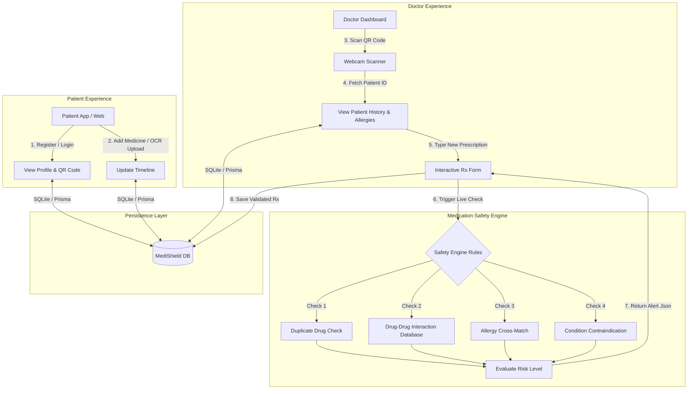
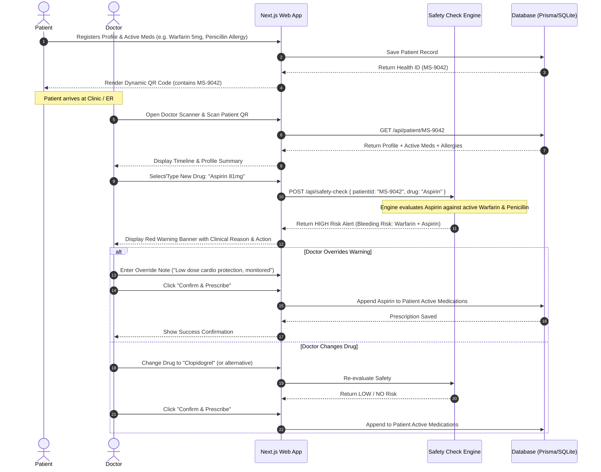

# 🎨 System Architecture & Design Specification — MediShield

> **Document Focus:** System Architecture, Data Flow Diagrams, Safety Engine Logic Matrix, and UI Component Design.

---

## 1. System Architecture Diagram



---

## 2. Sequence Diagram: End-to-End Clinical Flow



---

## 3. Medication Safety Engine Logic & Rules Matrix

The Safety Engine executes in deterministic memory for instant response (`<10ms`).

### 3.1 Decision Rules Order
```
Input: (Patient ID, New Prescribed Drug)
├── STEP 1: Fetch Patient Active Medications, Past Medications, Allergies, Conditions.
├── STEP 2: DUPLICATE CHECK
│    └── IF New Drug Name == Any Active Drug Name OR Generic Name
│         └── RETURN Risk: HIGH | Type: DUPLICATE | Reason: "Patient is already taking this active drug."
├── STEP 3: ALLERGY CHECK
│    └── IF New Drug / Drug Group matches Patient Allergies
│         └── RETURN Risk: HIGH | Type: ALLERGY | Reason: "Patient has documented allergy to this compound group."
├── STEP 4: DRUG-DRUG INTERACTION (DDI) CHECK
│    └── IF Pair (New Drug, Active Drug) in Interaction Database
│         └── RETURN Risk: HIGH / MEDIUM | Type: DRUG_DRUG | Reason: <Interaction Mechanism>
├── STEP 5: CONTRAINDICATION CHECK
│    └── IF Pair (New Drug, Condition) in Contraindication Database
│         └── RETURN Risk: HIGH / MEDIUM | Type: CONTRAINDICATION | Reason: <Condition Hazard>
└── STEP 6: DEFAULT
     └── RETURN Risk: NONE | Type: NONE | Reason: "No known conflicts detected."
```

### 3.2 Pre-seeded Drug Interaction Database (Sample Matrix)

| Drug A (Active) | Drug B (New Rx) | Risk Level | Conflict Type | Clinical Reason / Explanation | Suggested Action |
| :--- | :--- | :--- | :--- | :--- | :--- |
| **Warfarin** | **Aspirin** | 🔴 HIGH | DRUG_DRUG | Synergistic anti-platelet and anticoagulant effect dramatically increases major bleeding risk. | Avoid combination or closely monitor INR. |
| **Warfarin** | **Ibuprofen** | 🔴 HIGH | DRUG_DRUG | NSAIDs inhibit platelet aggregation and cause gastric ulceration when combined with Warfarin. | Switch to Acetaminophen (Paracetamol) for analgesia. |
| **Lisinopril** | **Potassium Supplements** | 🔴 HIGH | DRUG_DRUG | ACE inhibitors reduce potassium excretion; combination risks severe hyperkalemia and cardiac arrest. | Monitor serum potassium levels or choose alternative. |
| **Metformin** | **Contrast Dye** | 🟡 MEDIUM | CONTRAINDICATION | Intravenous iodinated contrast can induce acute renal failure, causing Metformin accumulation & lactic acidosis. | Discontinue Metformin 48 hours prior to contrast procedure. |
| **Simvastatin** | **Clarithromycin** | 🔴 HIGH | DRUG_DRUG | CYP3A4 inhibition by Clarithromycin leads to increased statin levels and rhabdomyolysis (muscle breakdown). | Suspend Simvastatin during antibiotic course. |
| **Penicillin Group** | **Amoxicillin** | 🔴 HIGH | ALLERGY | Amoxicillin is an aminopenicillin. Cross-reactivity in Penicillin-allergic patients causes anaphylaxis. | Do not prescribe. Use Macrolide (Azithromycin) instead. |

---

## 4. UI/UX Wireframe Specifications

### 4.1 Patient Dashboard (`/patient`)
```
+-----------------------------------------------------------------------+
|  🛡️ MediShield Patient Portal                     [ Health ID: MS-9042 ] |
+-----------------------------------------------------------------------+
|  John Doe | Age: 58 | Blood Group: O+ | Gender: Male                      |
|  Allergies: ⚠️ Penicillin (Severe)                                    |
+------------------------------------+----------------------------------+
|  Active Medications (2)            |  Your Health QR Code             |
|  ------------------------------    |  +----------------------------+  |
|  • Warfarin 5mg - Daily            |  |  [ QR CODE CANVAS ]        |  |
|    Prescribed by Dr. Smith         |  |  Scannable by any doctor   |  |
|  • Metformin 500mg - Twice Daily   |  +----------------------------+  |
|    Prescribed by Dr. Patel         |  [ 📥 Download QR ] [ 🖨️ Print ] |
|                                    |                                  |
|  [ ➕ Add Medication / Upload OCR ]|                                  |
+------------------------------------+----------------------------------+
```

### 4.2 Doctor Portal & Prescription View (`/doctor/patient/[id]`)
```
+-----------------------------------------------------------------------+
|  👨‍⚕️ MediShield Clinical Workspace                [ Patient: John Doe ]|
+-----------------------------------------------------------------------+
|  PATIENT SUMMARY                                                      |
|  Health ID: MS-9042 | Active Meds: Warfarin 5mg, Metformin 500mg        |
|  Known Allergies: Penicillin                                          |
+-----------------------------------------------------------------------+
|  NEW PRESCRIPTION BUILDER                                             |
|                                                                       |
|  Select Drug: [ Aspirin 81mg                ▼ ]                       |
|  Dosage:      [ 81mg            ]  Frequency: [ Once Daily       ▼ ]  |
|                                                                       |
|  +-----------------------------------------------------------------+  |
|  | 🔴 HIGH RISK SAFETY ALERT DETECTED                              |  |
|  | Conflict: Drug-Drug Interaction (Warfarin + Aspirin)            |  |
|  | Reason: Concomitant use increases severe GI & internal bleeding.|  |
|  | Action: Review before prescribing. Consider alternatives.      |  |
|  +-----------------------------------------------------------------+  |
|                                                                       |
|  [ Optional Override Reason: _______________________________ ]        |
|                                                                       |
|  [ ❌ Cancel ]                             [ ⚠️ Override & Prescribe ]|
+-----------------------------------------------------------------------+
```

---

## 5. Mock OCR Engine Specifications

For the 2-hour speedrun, the OCR engine provides instant, fail-safe extraction:
- **Input:** Image File (`prescription.png`, `strip.jpg`).
- **Processing Logic:** 
  1. If client Tesseract.js finishes within 3 seconds, parse text for drug keywords (`Warfarin`, `Aspirin`, `Metformin`, `Amoxicillin`, `Lisinopril`).
  2. Fallback Mock Extractor: If image analysis is selected, match filename/preset to auto-fill sample medicine details.
- **Output:** Prefilled form fields `drugName`, `dosage`, `frequency` ready for patient confirmation.
